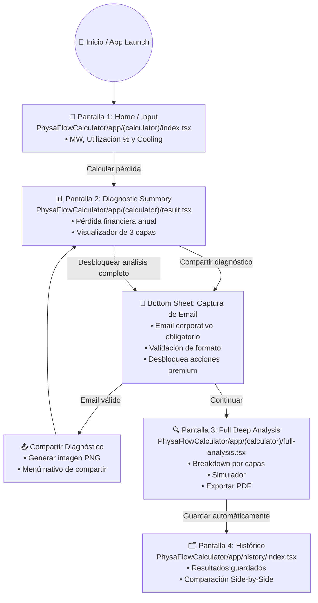

# 🗺️ Flujo de Usuario y Arquitectura de Experiencia (User Flow)

Este documento detalla el recorrido completo del usuario dentro de la calculadora **PhysaFlow**, definiendo la navegación por rutas de **Expo Router**, las interacciones clave y las transiciones entre pantallas.

---

## 📊 Diagrama de Flujo General

